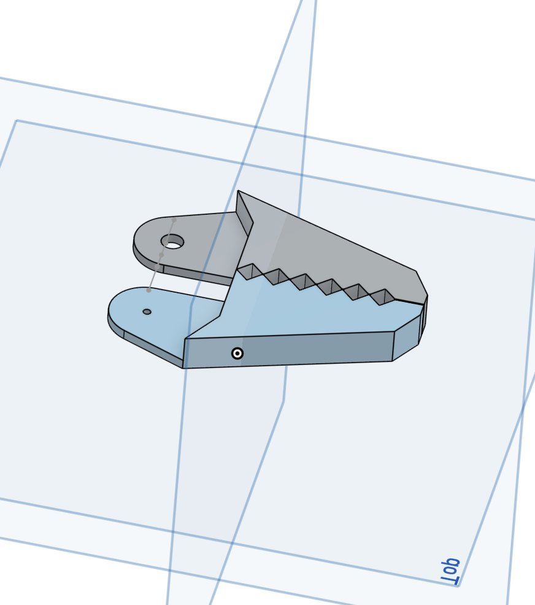
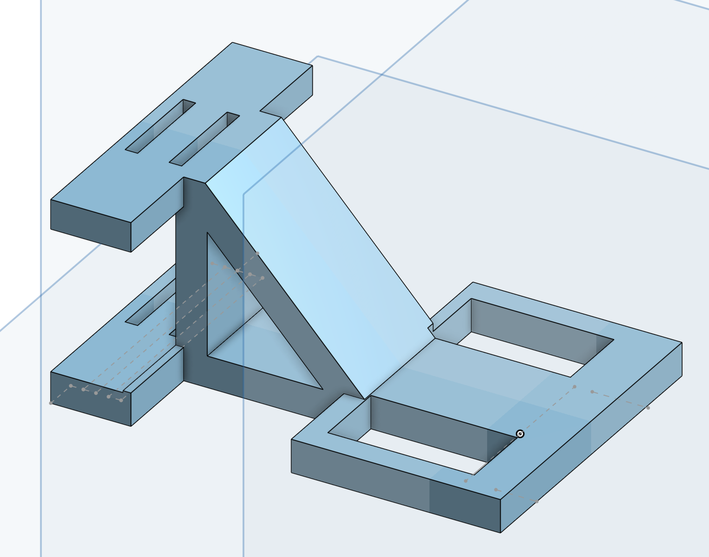
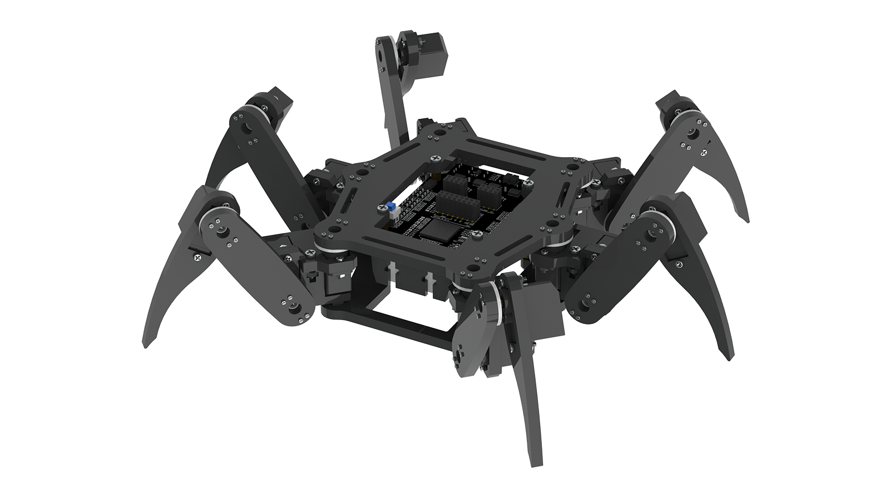

# HEXAPOD ROBOT OF DOOM

<!--Replace this text with a brief description (2-3 sentences) of your project. This description should draw the reader in and make them interested in what you've built. You can include what the biggest challenges, takeaways, and triumphs from completing the project were. As you complete your portfolio, remember your audience is less familiar than you are with all that your project entails!

You should comment out all portions of your portfolio that you have not completed yet, as well as any instructions:-->

<!--- This is an HTML comment in Markdown -->
<!--- Anything between these symbols will not render on the published site -->


| **Engineer** | **School** | **Area of Interest** | **Grade** |
|:--:|:--:|:--:|:--:|
| Joshua L. | The King's Academy | Mechanical Engineering | Rising Junior

<!--**Replace the BlueStamp logo below with an image of yourself and your completed project. Follow the guide [here](https://tomcam.github.io/least-github-pages/adding-images-github-pages-site.html) if you need help.**-->


# Modification (July 15th, 2024)

stufstufstuff



<span style="font-size:0.75em;">figure 6 : 3d model of mandibles</span>

<span style="font-size:0.75em;">figure 7 : 3d model of mandible mount</span>

  
# Final Milestone (June 25th, 2024)
**complete remote and other**

<iframe width="560" height="315" src="https://www.youtube.com/embed/6z4TW805CYg?si=IorbK040iQL3y76S" title="YouTube video player" frameborder="0" allow="accelerometer; autoplay; clipboard-write; encrypted-media; gyroscope; picture-in-picture; web-share" referrerpolicy="strict-origin-when-cross-origin" allowfullscreen></iframe>

Now the hexapod is complete! It's complete with 6 working legs, 3 methods of control wired connection, wifi hotspot connection, wireless controll using a remote, and a cover with straps to secure the replacement battery pack. Since the last milestone, I have assembled the remote controller and 3d printed the cover for the hexapod with velcro straps to hold the battery in place. So far, the biggest challenges in making it to this point was the stubborn or faulty hardware of the kit. Mainly it was the stubborn self tapping screws and the wifi wireless module which was shorted out of the box and even after I cleaned up the solders, it remained shorted burning my finger just a few times. During this time at Bluestamp many new topics and concepts were introduced to me including Ohm's law, creating 3d prints with OnShape, coding with Arduino, and the functions of many different electrical components like servos, gyroscopes etc., and soldering. Now that the base project is complete, the fun part starts with my modifications. This pupae of a hexapod of doom will soon be able to fully spread it's wings as a true force to be reckoned with. Hopefully in the process of modifying the hexapod I will be able to dive deeper into how the hexapod itself works and learn how to create my own parts.


<span style="font-size:0.75em;">Figure 5 : 3d render of remote control</span>

<span style="font-size:0.75em;">Figure 3 : 3d model of cover in onshape</span>

<span style="font-size:0.75em;">Figure 2 : schematic of freenove remote control arduino connected to WLAN module</span>

<!--

For your final milestone, explain the outcome of your project. Key details to include are:
- What you've accomplished since your previous milestone
- What your biggest challenges and triumphs were at BSE
- A summary of key topics you learned about
- What you hope to learn in the future after everything you've learned at BSE


-->
# Second Milestone (June 20th, 2024)
**Assemble and attatch legs, calibrate legs**
<!--
**Don't forget to replace the text below with the embedding for your milestone video. Go to Youtube, click Share -> Embed, and copy and paste the code to replace what's below.**
-->
<iframe width="560" height="315" src="https://www.youtube.com/embed/ff6MvHW-BKg?si=la6IosAkhYMUmGY9" title="YouTube video player" frameborder="0" allow="accelerometer; autoplay; clipboard-write; encrypted-media; gyroscope; picture-in-picture; web-share" referrerpolicy="strict-origin-when-cross-origin" allowfullscreen></iframe>

  Since the first milestone, I've attatched the servos to the acrylic frame, assembled the legs, wired in the servos, calibrated the legs, added the given and extra cable management, and installed the WLAN module. Now, the hexapod is capable of fully cordinated walking and body manipulation. Using wifi to controll the hexapod, I can controll the X Y movement, rotation on a vertical axis, Z elevation movement, X Y location of the central body in relation to the contact points of the legs, and the roll and pitch of the central body. All the servos that are used to preform these movements are connected to pins on the bottom side of the controller and using given cord wraps and additional zipties I secured the extra wire from the servos to avoid any obstruction during movement. My previous assumption that the self tapping screws would be a pain to use again was revealed true but now I prepared for it using rubber bands to create a more comfortable grip of the small screwdriver. My final milestone is creating the remote controll but I also intend to add a cover for the top of the hexapod to hold the large battery before I call the hexapod complete.


<span style="font-size:0.75em;">Figure 4 : 3d render of hexapod</span>

<!--
For your second milestone, explain what you've worked on since your previous milestone. You can highlight:
- Technical details of what you've accomplished and how they contribute to the final goal
- What has been surprising about the project so far
- Previous challenges you faced that you overcame
- What needs to be completed before your final milestone 

-->

# First Milestone (June 13th, 2024)
**Install code to controller, assemble central body**
<!--**Don't forget to replace the text below with the embedding for your milestone video. Go to Youtube, click Share -> Embed, and copy and paste the code to replace what's below.**-->

<iframe width="560" height="315" src="https://www.youtube.com/embed/tXRV1RJAYvk?si=9CbVaSSGl9AUW2tx" title="YouTube video player" frameborder="0" allow="accelerometer; autoplay; clipboard-write; encrypted-media; gyroscope; picture-in-picture; web-share" referrerpolicy="strict-origin-when-cross-origin" allowfullscreen></iframe>

  My main project this summer is the freenove hexapod robot. The hexapod is built with a arduino mega as the controller for 18 servos which moves the legs. All of it is secured with screws onto an acrylic frame. So far I have used arduino IDE to upload the given programs to the controller and tested all the servos while conected to it. In addition, I connected a replacement power source to the controller and that to the acrylic frame. On the acrylic frame, I screwed discs for the servos to connect to using self tapping screws. That was the greatest challenge as the self tapping screws were stubborn and did not want to cut into a thread without a fight. Looking ahead to the many disks i'll have to screw in for the legs, I should to find a new efficeint method that doesn't kill my hands. Next up, I'll assemble the legs and calibrate them, then assemble the remote control. 


<span style="font-size:0.75em;">Figure 1 : schematic of freenove controller arduino circuit connected to servos</span>

<!-- For your first milestone, describe what your project is and how you plan to build it. You can include:
- An explanation about the different components of your project and how they will all integrate together
- Technical progress you've made so far
- Challenges you're facing and solving in your future milestones
- What your plan is to complete your project-->


<!-- Here's where you'll put images of your schematics. [Tinkercad](https://www.tinkercad.com/blog/official-guide-to-tinkercad-circuits) and [Fritzing](https://fritzing.org/learning/) are both great resoruces to create professional schematic diagrams, though BSE recommends Tinkercad becuase it can be done easily and for free in the browser. 

Here's where you'll put your code. The syntax below places it into a block of code. Follow the guide [here]([url](https://www.markdownguide.org/extended-syntax/)) to learn how to customize it to your project needs. 

```c++
void setup() {
  // put your setup code here, to run once:
  Serial.begin(9600);
  Serial.println("Hello World!");
}

void loop() {
  // put your main code here, to run repeatedly:

}
```
-->

# Code
**all the code that was added**

code to initialize LED strip and set all 17 lights to red
```c++
#include <FNHR.h>
#include <FastLED.h>
FNHR robot;
CRGB lights[17];

void setup() {
  Serial.begin(115200);
  FastLED.addLeds<NEOPIXEL, 2>(lights, 17);
  robot.SetActionSpeed(90);
  for(int i = 0; i < 17; i++){
      lights[i].setRGB( 255, 0, 0);
  }
  FastLED.show();
  robot.Start(true);
}
```
$~$
(within given code to check for each switch's status on remote) to check if all switches are selected (off technically) and if so to send request for chomping and unchomping of mandibles depending on the joystick's Y value.
```c++
      else //S1 and S2 are on
      {
        if(s3Value){ //if S3 is off
          rf24OutData[rf24OutDataCounter++] = 0 + 64;
          rf24OutData[rf24OutDataCounter++] = map(joystickYValue, 0, 1024, 42, -42) + 64;
          if(joystickYValue < 512)
            rf24OutData[rf24OutDataCounter++] = map(joystickXValue, 0, 1024, -18, 18) + 64;
          else
            rf24OutData[rf24OutDataCounter++] = map(joystickXValue, 0, 1024, 18, -18) + 64;
        }else{
        if(joystickYValue < 712){
          rf24OutData[rf24OutDataCounter++] = Orders::requestUnChomp;
          Serial.println("unchomp request");
        }else if(joystickYValue > 312){
          rf24OutData[rf24OutDataCounter++] = Orders::requestChomp;
          Serial.println("chomp request");
        }else{
          rf24OutData[rf24OutDataCounter++] = Orders::requestEcho;
        }
        }
```

code to make sure chomping and unchomping are carried
```c++
  if (blockedOrder == Orders::requestChomp){
    SaveRobotBootState(Robot::State::Boot);
    robotAction.Chomp();
  }

  if (blockedOrder == Orders::requestUnChomp){
    SaveRobotBootState(Robot::State::Boot);
    robotAction.UnChomp();
  }
```

code to initialize both mandible servos and to chomp (while is to make jaws close at same time instead of in order)
```c++
Servo leftServo;
Servo rightServo;
boolean servosInitialized = false;


void RobotAction::Chomp(){
  if(!servosInitialized){
    leftServo.attach(3);
    rightServo.attach(A1);
    servosInitialized = true;
  }
  Serial.begin(115200);
  Serial.println("Chomp");
  while(leftServo.read() < 94 && rightServo.read() > 92){
    leftServo.write(leftServo.read()+1);
    rightServo.write(rightServo.read()-1);

  }
}

void RobotAction::UnChomp(){
  if(!servosInitialized){
    leftServo.attach(3);
    rightServo.attach(A1);
    servosInitialized = true;
  }
  Serial.begin(115200);
  Serial.println("unChomp");
  while(leftServo.read() > 45 && rightServo.read() < 135){
    leftServo.write(leftServo.read()-1);
    rightServo.write(rightServo.read()+1);
  }
}
```
# Bill of Materials
<!--Here's where you'll list the parts in your project. To add more rows, just copy and paste the example rows below.
Don't forget to place the link of where to buy each component inside the quotation marks in the corresponding row after href =. Follow the guide [here]([url](https://www.markdownguide.org/extended-syntax/)) to learn how to customize this to your project needs. -->

| **Part** | **Note** | **Price** | **Link** |
|:--:|:--:|:--:|:--:|
| Acrylic parts | the frame of the hexapod (included in kit) | $126.95 | <a href="https://www.amazon.com/Freenove-Raspberry-Crawling-Detailed-Tutorial/dp/B07FLVZ2DN/ref=sr_1_1_sspa?crid=3GRGXL8PEZT3U&dib=eyJ2IjoiMSJ9.hyUjFCpcxtDvB6cSLdESXXxW_VlbfCW2sOuFZvcbQOIGmEBuC7OEUMaQFc9QwW4IXwx7Zam6zEOeONweFsjLFZKuOqUCxQ5HgmvRD4UQFOYNFty3scPqGq5J1g0TbtR_2bIyILUc5M0WNMqrnGrTWylHLQa3aQ613NmcWejs9wWrqJxOj5YOl3gf1PQej0RBbHZ0JXoReeEgeIy4xsbSajM-ZdqX12H5uQ_PnnmQRkQ.Nc_RRueNOp6PjfXo9382ZkI3SC-BbbYPBJXb0-GxLOo&dib_tag=se&keywords=freenove%2Bhexapod%2Brobot&qid=1718322574&sprefix=freenove%2Bhexapod%2Brobo%2Caps%2C133&sr=8-1-spons&sp_csd=d2lkZ2V0TmFtZT1zcF9hdGY&th=1"> Link </a> |
| Freenove Crawling Robot Controller Arduino | central controller for servos (included in kit) | $126.95 | <a href="https://www.amazon.com/Freenove-Raspberry-Crawling-Detailed-Tutorial/dp/B07FLVZ2DN/ref=sr_1_1_sspa?crid=3GRGXL8PEZT3U&dib=eyJ2IjoiMSJ9.hyUjFCpcxtDvB6cSLdESXXxW_VlbfCW2sOuFZvcbQOIGmEBuC7OEUMaQFc9QwW4IXwx7Zam6zEOeONweFsjLFZKuOqUCxQ5HgmvRD4UQFOYNFty3scPqGq5J1g0TbtR_2bIyILUc5M0WNMqrnGrTWylHLQa3aQ613NmcWejs9wWrqJxOj5YOl3gf1PQej0RBbHZ0JXoReeEgeIy4xsbSajM-ZdqX12H5uQ_PnnmQRkQ.Nc_RRueNOp6PjfXo9382ZkI3SC-BbbYPBJXb0-GxLOo&dib_tag=se&keywords=freenove%2Bhexapod%2Brobot&qid=1718322574&sprefix=freenove%2Bhexapod%2Brobo%2Caps%2C133&sr=8-1-spons&sp_csd=d2lkZ2V0TmFtZT1zcF9hdGY&th=1"> Link </a> |
| Servos (18x) | moves the segments of the hexapod (included in kit)| $19.99 X 5 | <a href="https://www.amazon.com/4-Pack-MG996R-Torque-Digital-Helicopter/dp/B07MFK266B/ref=sr_1_5?crid=2H6AEQNM44N4Y&dib=eyJ2IjoiMSJ9.Xjft-sUgM8c06EWiLToCu4ud5JSQpFSGJkvQnX4fus4I4PZyuINWhqg8p_LC5gLj_WbPwzSBaCeuv9W8TU16xJX3hTjftpNiGKlHRg2As16eOZ_18xgwUxwDYlzBNfwAPVHV8bDeOypgJtwh8UaEFKnHrh_KhZkdZOMwB2N0BPTe0lg1xbiRREm8Wn7elwv8GPZ1WwKvHjTgFhAxY4aYllPVPwE9K74gp6ATOxvrDQCs1uLhONY2X6ngr4CrnhUNcqNpcSkbdPo9ARfqQw2EdlQ86Tt8fVau2DRaFNaw9nk.XTGqJoZ8VaXxMYT7SIcKoguYgE1NZvnKonSMce5t_3g&dib_tag=se&keywords=servo&qid=1718408609&sprefix=servo%2Caps%2C776&sr=8-5&th=1"> Link </a> |
| ESP8266 Wi-Fi Module | enables remote controll from phone/remote (included in kit) | $6.59 | <a href="https://www.amazon.com/DIYmall-ESP8266-ESP-01S-Serial-Transceiver/dp/B00O34AGSU/ref=sr_1_5?crid=3GOL6I3EBGMIH&dib=eyJ2IjoiMSJ9.px4FtI_71QkacyvDpqIgx5j1tyPiXy_PgILs48PN144lSZvCaKm2AOFPYgKCqSVIdZhyHrZDfihzbCAuRbWKXKiFtMR5tJ1mXERCLMzlSv1VXnAFYJQOXPCdbwhg-g-zGNtYK9nyL_OQiNxUHS6AYFskb5BtUFB5zVvsY6_7l7JdjoqmRSY8haWrQoFlIBxIAcY5iK5PUNYkw2KlUztoKh_Iku1NaPCtwa3b7hNmbwg.7qZaFQ9e98Zz9RaFN0CEo8BdSPigvtGldXWbx9T1DMA&dib_tag=se&keywords=ESP8266+Wi-Fi+Module+x1&qid=1718408880&sprefix=esp8266+wi-fi+module+x1%2Caps%2C136&sr=8-5"> Link </a> |
| Cable Tidy | to wrap up and keep cables neat (included in kit) | $12.99 | <a href="https://www.amazon.com/D-Line-Spiral-Management-Solution-Organize/dp/B00OTRUW7G?source=ps-sl-shoppingads-lpcontext&ref_=fplfs&smid=AIVUHJ2NABNJF&th=1"> Link </a> |
| NiMH sub-C batteries x6 | the power source | $3.99 x 6 | <a href="https://power.tenergy.com/tenergy-propel-sub-c-3000mah-nimh-flat-top-rechargeable-battery/"> Link </a> |
| 4 inch zipties x6 | for extra cable management | $11.29 | <a href="https://www.amazon.com/Monday-HS-Plastic-Self-Locking-Electronics-Electrical/dp/B078NT5F2B/ref=sr_1_6?crid=36KQE6KZ5T53Y&dib=eyJ2IjoiMSJ9.7Ue6x10STH4mwycfHZtSsKN24UvTGoqsZwaXErIeGgf_UHp51xjXhJBfDgAGmW45-Jma28IuTEEnxB_CyUAurI4UEn0ylTYVNm_bvyo5sjHzI8xl94xSdnbu7ifK56rV3pMNzgIw87gN_U3WEDLK4Fm30xjNrhbSSouhDofYWChxoGgV6-r8vtWa3na5h3s_wgia_n8Y4OVGO9aDOuahK7lI0YwLVUMbyjoTZhifsig.j0IozqhEFrwj2F5okU1KEVnSyWD-Oso_CBUUIVqS-J8&dib_tag=se&keywords=zip%2Bties%2B4%2Binch&qid=1718750635&sprefix=zip%2Bties%2B4%2Binch%2Caps%2C131&sr=8-6&th=1"> Link </a> |
| male to male wires | for connecting modifications to arduino | $6.98 | <a href="https://www.amazon.com/EDGELEC-Breadboard-Multicolored-1pin-1pin-Connector/dp/B07GD1ZCHQ/ref=sr_1_3?crid=GAWMNGI0HXY2&dib=eyJ2IjoiMSJ9.8NpNmMD6xFLT2k0JQKFsmJEnPNcqwilxlCYQmL8fq6aqFP97GUEyGtXF2AZAq0YKEdXQO1hCcvHaFIVdTHmT06RkL6nATonQjp9jFmw6dCLpYs71hT1FpYJBLTP-98h7Q0Xlhz2I_AeWKH-6vLcE_3JVe5en9Js2vMVPta8cnFDMavUgN7elPfqydVaz-1AVPzoDtsUVkZXdCk-XtjUzOTGX1vZZTz28o7HSECvUKyU.nCLi7_hbvbKvfSkhG90xCcQSi1N9uBSBi6PEf9YAdXw&dib_tag=se&keywords=male%2Bto%2Bmale%2Bpin%2Bcable&qid=1720741411&sprefix=male%2Bto%2Bmale%2Bpin%2Bcable%2Caps%2C130&sr=8-3&th=1"> Link </a> |
| proto board | increase amount of space for pins, organization | $3.49 | <a href="https://www.amazon.com/SchmalzTech-Protoboard-Solderable-Breadboard-ST-PROTO-1-8/dp/B0BK76L5BD/ref=sr_1_2_sspa?crid=3UAIDJXQ5K1AV&dib=eyJ2IjoiMSJ9.cFO3IbuqDHBg13mO-bkEuACd5Zpdn3bIfhsKmn2gG7nds8rNrevKtkuYb3a8ujVOpOpVCvq2ufh7oTi2NVDRkPuTyZ05GHqWjeyJ7ppZbRSTs6WGGOnCZrRgCQGuEGdiZo9Uc_0RJZZHe5-GZY68ecjPpHSdrKGTJvvEHaYD4sjV1aZp2y8uzxNoRASKM0A8N7-w6Qi-bKE3NpkxvYZ6986CPR0gc8S9jePZLU9ogP4.Q2NB3oT9SBHdR08IHEKCbqF5rOD-oaSqjCBawtEJYMM&dib_tag=se&keywords=proto%2Bboard&qid=1720741909&sprefix=proto%2Bbao%2Caps%2C365&sr=8-2-spons&sp_csd=d2lkZ2V0TmFtZT1zcF9hdGY&th=1"> Link </a> |
| breadboard switch | to allow mandible's power supply to be switched off | $6.49 | <a href="https://www.amazon.com/Position-Breadboard-Electronic-Miniature-SlideSwitch/dp/B09R43HCY3/ref=sr_1_1_sspa?crid=1YEVBYSRM7PW3&dib=eyJ2IjoiMSJ9.wGc51wYaBsA1ju-17tk1UuRHu3twBxxOWLzjOGSL5Uc8X9BHt1hHpwZh050snFVjViqsVy-t5qgWNlKg6FnnWht-RdEP6mdg_VbVAZYv8Vx61Kldsn3P_-jrjrwDe7QEnCNW3cFMZ18I4lASX95TfSkyK0L1q33CALOS-RLS2SZJIsXDHFqkGh4o4ydu7vwzkTvl7FxFVf4_A7fpQiuFLahWFlALLeeDO2nadqFYJVg.2PCiauPSkSQ2U9-4nfGfZyk9CYS_TJgLfjn8hGHxKoo&dib_tag=se&keywords=breadboard%2Bswitch&qid=1720742305&sprefix=breadboard%2Bswitch%2Caps%2C144&sr=8-1-spons&sp_csd=d2lkZ2V0TmFtZT1zcF9hdGY&th=1"> Link </a> |
| Servos (x2) | for mandible (not from kit) | $18.99 | <a href="https://www.amazon.com/Micro-Helicopter-Airplane-Remote-Control/dp/B072V529YD/ref=sr_1_2_sspa?crid=3IR6WDGKRPG5P&dib=eyJ2IjoiMSJ9.dBdkJvPiQJ7jUrr8EK4vfralyOwU4TuhJ4XpwoYb9QILd0E_e2orC95rJa5VHq4YOTxfRrUUCr7E8_hNPGnBn3XythebGKUu3LrL5urls0fmKT0N_uPsrtABFl1CucN_gePpwgYhLfXNj46pznjKg1PSRPIFl2EABlPXEiKg38biyxwUvzwlLXkcZKpzbPx9amUGXJgogva3xzoYLe2rgYHWiHf-4F_U-yalKUR5H774yysOeVf3tXEJoz5q5oJ3tfBWyYVxLsXy9SRyA_EhioIy6Ud-qPgthAe6foWtFY0.XKsg3LRu1Qo4B8wZ-meT8XexX9pO0tG0KvB1QbKGg8Y&dib_tag=se&keywords=servo&qid=1721078744&sprefix=servo%2Caps%2C158&sr=8-2-spons&sp_csd=d2lkZ2V0TmFtZT1zcF9hdGY&psc=1"> Link </a> |
| LED strip | for an ambiance | $22.99 | <a href="https://www.amazon.com/LOAMLIN-WS2812B-Individually-Addressable-Waterproof/dp/B0956JQ68N/"> Link </a> |
| electrical tape | organize and hold wiring | $11.92 | <a href="https://www.amazon.com/Amazon-Basics-Electrical-Automotive-Equipment/dp/B07YDRY8ZS/ref=sr_1_1_ffob_sspa?crid=1OFHDWZ14B0WW&dib=eyJ2IjoiMSJ9.C_H2VZv9tXT8owUlDyjFvmlBCALySfE0cU7ZXu8ttpTsdiOWz9XjWXYw9ygKT5dP13MDOm2AYvFEn6EuNXHqDzJPRxguHKrXPQ4AKdKh6-ynPPIF-8X-2ng0HAvTmhs2XJnSc-qIZnAJpQ-l8OAl7KmcClJU0CRcYx5MiEJcy7VhTiHXjLORJ9lJFH9ALOw1yqCL4nTxnGDspMz91zxJyZb43hofg7MEKfpnpAw8lsjSrecvbbY06QEEu7bFcqnzyak599XRPZET8U0uoyN-A79Z5JRBSQdIqMWr-pnoxTo.33egdYqJmxBvoGwSivyLGFuPeH1e3-XfDxnbSo5Xnjs&dib_tag=se&keywords=black+electrical+tape&qid=1721078896&s=hi&sprefix=black+electical+tap%2Ctools%2C123&sr=1-1-spons&sp_csd=d2lkZ2V0TmFtZT1zcF9hdGY&psc=1"> Link </a> |
| Googly eyes | make it more obvious to which direction it's facing | $3.99 | <a href="https://www.amazon.com/UPINS-Wiggle-Googly-Self-Adhesive-Packaging/dp/B08KG37QN1/ref=sr_1_6?dib=eyJ2IjoiMSJ9.Mz81R4_11Mz4Vpo4uPGDkhCCYllA7nfVJKygcPgDm7YAgCS0IqdD4lbZaoxuZ2oTmTkYPo8VuoRjqWFPMQWqGnv7MqZGMzVQawtbGCYhkit2i_hxoKuzpqxFYAMCGmsfVfp6o96lw_DfOtpHWp_QCq99Zr9DbUO_Q-y1U-PtSW5QLbUMRiXsmla8NRwj8fLderny-3yIPDtOLDttp0hl1LyConqlIQSiKdCs1MBx0sq3ozrz2iGHlYc4X8_YATpb53vdotDl5CqwD8ma60OEoiCCZRHiA_K5X9QhXIwoSVU.RFKiTZ6yNUGJWPfYCctjopf3GRxHzgkmVNFI-vvS3rw&dib_tag=se&keywords=googly%2Beyes&qid=1721085429&sr=8-6&th=1"> Link </a> |
| 9 volt battery | power the mandibles | $12.37 | <a href="https://www.amazon.com/Amazon-Basics-Performance-All-Purpose-Batteries/dp/B00MH4QM1S/ref=sr_1_1_ffob_sspa?crid=E48IKJ3PGWYU&dib=eyJ2IjoiMSJ9.koxYfvBAfTlQjm5SiFOlez4j5bpKY4rInb-6Q1iUh91lFcGjutkpE9SOvYWWyQugIOOsMJXget_M5hTDE30fqG8cfzgJhzM3LRy45irDXZU3mPt0K3YGs3vhrrzA3fWhU26ifsiW1ym8My2bCz6C4gudB23k6caN0Yn__18ZRhCIwJbvQQ_L4xFNSrLAXju1xwr_rN-xzti_l_4MsHtrWv27tljxQBzNIbA-aFJ-FJ8XPO-bvvCGh_wfSGlWz8wZyNK4Oddr6BzZfjiYI4-YDXONq5DbNDmhgTdTQEZ-UZA.zEE8gZ9tMOG42gJByAbHihXEp2bYArZ3bWMgRcKSUpw&dib_tag=se&keywords=9v%2Bbattery&qid=1721085826&sprefix=9v%2Bbattery%2Caps%2C148&sr=8-1-spons&sp_csd=d2lkZ2V0TmFtZT1zcF9hdGY&th=1"> Link </a> |
| 9 volt battery connector | to connect wiring to mandibles | $4.99 | <a href="https://www.amazon.com/Battery-Connector-Plastic-Experiment-Equipment/dp/B08SL9X2YC/ref=sr_1_1_sspa?crid=1KKYY8VPAV4B8&dib=eyJ2IjoiMSJ9.cPyl9XTIX6B9MfgCRRpDEl2dIntxXv-df2Q49J8AsKpKzEb1lN4fLX1pEIS_nffc9SPrTB86af3q8xkPiKqMv-e6C7XZe8nfrQIXv0d4EcBm6Lm7oHVMdL1y8S2TDazCZOfzeLej1PG-5YfOYy9BK2qm4xi9Kx1ov4EchJeumnnPdJPjFGAa-0T9kINdOrXxRAOBU5H2F7Z_qy8lsG9Hnub-EY2dkuSguA2uUQcNk7M.6Yvyr8sMKl-EdOHhvrbihgM-NB0aqpzYM8u4tzN5r4o&dib_tag=se&keywords=9v%2Bbattery%2Bconnector&qid=1721085897&sprefix=9v%2Bbattery%2Bconnecte%2Caps%2C131&sr=8-1-spons&sp_csd=d2lkZ2V0TmFtZT1zcF9hdGY&th=1"> Link </a> |
| velcro strips | hold large battery in place | $9.90 | <a href="https://www.amazon.com/Melsan-inch-Hook-Loop-Tape/dp/B07Y3VDPLF/ref=sr_1_1_sspa?crid=L1KPUUY2THMB&dib=eyJ2IjoiMSJ9.lAO9pug3aqVjexa3Sr63jTWAi6yVfa9OvKajYCzrD2GISIpXOOGH1oq5fSFX1ep2zU5dz7dBX6o4gUqOdQiHZhzaY1yTmTUT5DofPBfAPwHWdGCrrHUSyzMjLpVzqmhnokKzPsZ-6yJ5yV5e9mv97G6rTdKr9uYAwMnFT8If7_HxDC89IViefm4VxmVDGqq4_GSxvQIp1nevx7Xkynf3l5EuBvHA3aZs8pt_MgMPNMgCQ6J5bVxoqyrdrQv6grgX6_jCYQYE-mLZo6phPJpwuaOFSDdgt1VJcD6pnEgDOEA.5ZMOjy_uuOhGkZLRk8TSl-JYFeEtZ0s6TJUoKlN8HBQ&dib_tag=se&keywords=velcro+strips+with+adhesive&qid=1721085985&sprefix=velcro%2Caps%2C133&sr=8-1-spons&sp_csd=d2lkZ2V0TmFtZT1zcF9hdGY&psc=1"> Link </a> |


<!--| Item Name | What the item is used for | $Price | <a href="https://www.amazon.com/Arduino-A000066-ARDUINO-UNO-R3/dp/B008GRTSV6/"> Link </a> |
-->

# Other Resources/Examples
 - Freenove's given files ( instuctions, code, part details) : <a href="https://github.com/Freenove/Freenove_Hexapod_Robot_Kit"> link </a>
 - 3d models (onshape) : <a href="https://cad.onshape.com/documents/7d4e9042e525032ecd115171/w/c8315eaa0f0c128825d19e17/e/63f65948613e60d742015e8e"> link </a> <a href="https://cad.onshape.com/documents/d2edb641c19bf7c828e322c5/w/7609b415a7e97c226836dc19/e/4187b853b489136bbf28ab99"> link2 </a> <a href="https://cad.onshape.com/documents/e69c578ea8e21ad575e0b708/w/75def1c7b92655eef86b8e8e/e/980f061873b26be92a16706a"> link3 </a>

<!--
One of the best parts about Github is that you can view how other people set up their own work. Here are some past BSE portfolios that are awesome examples. You can view how they set up their portfolio, and you can view their index.md files to understand how they implemented different portfolio components.
- [Example 1](https://trashytuber.github.io/YimingJiaBlueStamp/)
- [Example 2](https://sviatil0.github.io/Sviatoslav_BSE/)
- [Example 3](https://arneshkumar.github.io/arneshbluestamp/)

To watch the BSE tutorial on how to create a portfolio, click here.
-->
# Starter Milestone (June 11th, 2024)

<!--**Don't forget to replace the text below with the embedding for your milestone video. Go to Youtube, click Share -> Embed, and copy and paste the code to replace what's below.**-->

<iframe width="560" height="315" src="https://www.youtube.com/embed/qlhCMnZTruI?si=ikTGbaKnIwISUNnV" title="YouTube video player" frameborder="0" allow="accelerometer; autoplay; clipboard-write; encrypted-media; gyroscope; picture-in-picture; web-share" referrerpolicy="strict-origin-when-cross-origin" allowfullscreen></iframe>

For my starter project I made a retro gaming console. Most of the work consisted of soldering which is something I newly learned this week. To make it I was solder on a switch, buttons, a usb port, displays, batterys, and a buzzer. All the code for the games that it could play was already loaded onto the CPU on the board so the challenge was to solder all the components neatly and seperate in order to avoid a short. Through a few mistakes I made and what I did to fix it, I learned the importance of the amount of solder used and how to desolder.
